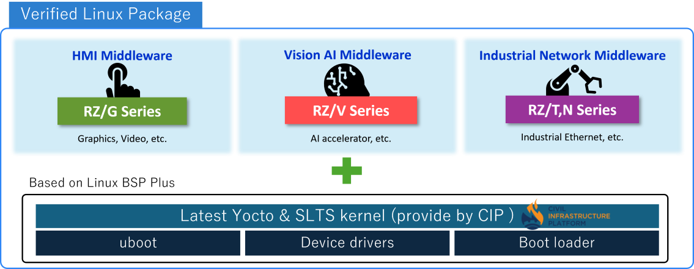
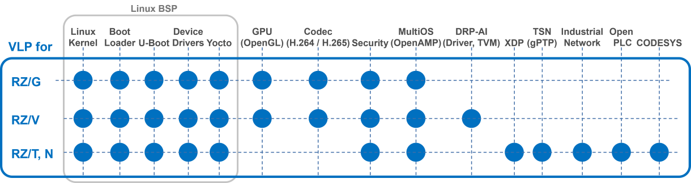

# Verified Linux Package for RZ MPU 

Verified Linux Package (VLP) for RZ MPU
{: .subtitle .center }

VLP provides 10-year maintenance support for the Linux BSP built on the SLTS kernel/CIP.
{: .sub-subtitle .center }

{ width=100% }

* Provides Yocto recipes and documentations for VLP by Renesas.com 
* It also supports middleware specialized for target applications.
* Life cycle is 10 years.

{ width=100% }

**What is the Civil Infrastructure Platform (CIP)?**  
The [Civil Infrastructure Platform](https://www.renesas.com/products/microcontrollers-microprocessors/rz-mpus/rz-partner-solutions/civil-infrastructure-platform-cip) is a platform that aims to establish a base layer for building Linux-based embedded systems that satisfy the requirements of modern civil infrastructure. It is driven by The Linux Foundation and global leading infrastructure system manufacturers.

**Trademark:**
Civil Infrastructure Platform and CIP are trademarks of The Linux Foundation in the United States and other countries.




